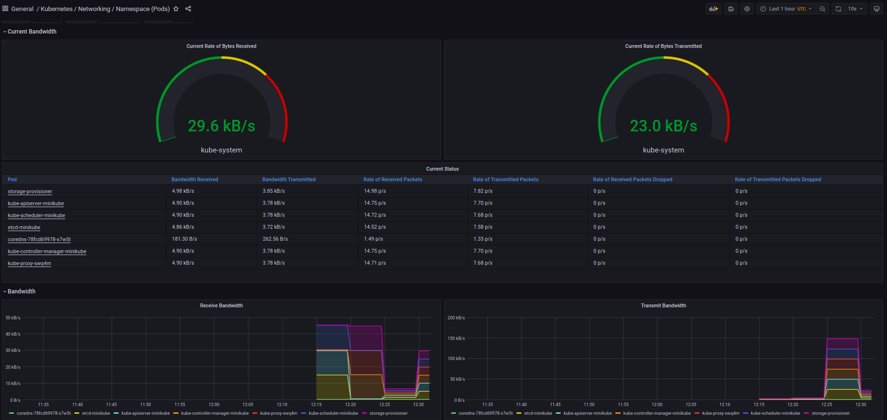

# 14.md

## kube-prometheus-stack

1. Prometheus operator - automatic confuguration for kubernetes enviroment
2. Prometheus - monitoring and alerting
3. AlertManager - handles alerts
4. Prometheus node-exporter - pulls OS metrics
5. Prometheus Adapter for Kubernetes Metrics APIs - Kubernetes Metrics APIs implementation
6. kube-state-metrics - generates metrics from Kubernetes API
7. Grafana - GUI dashboards


### kubectl get

```bash
kubectl get po,sts,svc,pvc,cm
NAME                                                            READY   STATUS    RESTARTS        AGE
pod/alertmanager-kube-prometheus-stack-alertmanager-0           2/2     Running   0               10m
pod/kube-prometheus-stack-grafana-5566bcc5b5-gwr2p              2/2     Running   0               10m
pod/kube-prometheus-stack-kube-state-metrics-7f996bfdc7-4r4xk   1/1     Running   0               10m
pod/kube-prometheus-stack-operator-5f66cc66bf-vppck             1/1     Running   0               10m
pod/kube-prometheus-stack-prometheus-node-exporter-vmfcb        1/1     Running   1 (7m31s ago)   10m
pod/msk-time-0                                                  0/1     Running   0               49s
pod/msk-time-1                                                  0/1     Running   0               49s
pod/prometheus-kube-prometheus-stack-prometheus-0               2/2     Running   0               10m

NAME                                                               READY   AGE
statefulset.apps/alertmanager-kube-prometheus-stack-alertmanager   1/1     10m
statefulset.apps/msk-time                                          0/2     58s
statefulset.apps/prometheus-kube-prometheus-stack-prometheus       1/1     10m

NAME                                                     TYPE           CLUSTER-IP       EXTERNAL-IP   PORT(S)                      AGE
service/alertmanager-operated                            ClusterIP      None             <none>        9093/TCP,9094/TCP,9094/UDP   10m
service/kube-prometheus-stack-alertmanager               ClusterIP      10.99.58.1       <none>        9093/TCP                     11m
service/kube-prometheus-stack-grafana                    ClusterIP      10.103.163.60    <none>        80/TCP                       11m
service/kube-prometheus-stack-kube-state-metrics         ClusterIP      10.102.98.19     <none>        8080/TCP                     11m
service/kube-prometheus-stack-operator                   ClusterIP      10.108.241.87    <none>        443/TCP                      11m
service/kube-prometheus-stack-prometheus                 ClusterIP      10.104.147.146   <none>        9090/TCP                     11m
service/kube-prometheus-stack-prometheus-node-exporter   ClusterIP      10.107.21.157    <none>        9100/TCP                     11m
service/kubernetes                                       ClusterIP      10.96.0.1        <none>        443/TCP                      15h
service/msk-time                                         LoadBalancer   10.107.248.200   <pending>     5000:32374/TCP               59s
service/prometheus-operated                              ClusterIP      None             <none>        9090/TCP                     10m

NAME                                               STATUS   VOLUME                                     CAPACITY   ACCESS MODES   STORAGECLASS   AGE
persistentvolumeclaim/visitors-volume-msk-time-0   Bound    pvc-14029c0f-b157-4421-893e-b4cca46f4a37   256M       RWO            standard       15h
persistentvolumeclaim/visitors-volume-msk-time-1   Bound    pvc-f4e6d77d-9db5-46a2-9600-2d8937bc0db3   256M       RWO            standard       15h
persistentvolumeclaim/visits-msk-time-0            Bound    pvc-0ed6315a-32e6-4272-904c-93b6376e7ba1   256M       RWO            standard       15h

NAME                                                                DATA   AGE
configmap/kube-prometheus-stack-alertmanager-overview               1      11m
configmap/kube-prometheus-stack-apiserver                           1      11m
configmap/kube-prometheus-stack-cluster-total                       1      11m
configmap/kube-prometheus-stack-controller-manager                  1      11m
configmap/kube-prometheus-stack-etcd                                1      11m
configmap/kube-prometheus-stack-grafana                             1      11m
configmap/kube-prometheus-stack-grafana-config-dashboards           1      11m
configmap/kube-prometheus-stack-grafana-datasource                  1      11m
configmap/kube-prometheus-stack-grafana-test                        1      11m
configmap/kube-prometheus-stack-k8s-coredns                         1      11m
configmap/kube-prometheus-stack-k8s-resources-cluster               1      11m
configmap/kube-prometheus-stack-k8s-resources-namespace             1      11m
configmap/kube-prometheus-stack-k8s-resources-node                  1      11m
configmap/kube-prometheus-stack-k8s-resources-pod                   1      11m
configmap/kube-prometheus-stack-k8s-resources-workload              1      11m
configmap/kube-prometheus-stack-k8s-resources-workloads-namespace   1      11m
configmap/kube-prometheus-stack-kubelet                             1      11m
configmap/kube-prometheus-stack-namespace-by-pod                    1      11m
configmap/kube-prometheus-stack-namespace-by-workload               1      11m
configmap/kube-prometheus-stack-node-cluster-rsrc-use               1      11m
configmap/kube-prometheus-stack-node-rsrc-use                       1      11m
configmap/kube-prometheus-stack-nodes                               1      11m
configmap/kube-prometheus-stack-persistentvolumesusage              1      11m
configmap/kube-prometheus-stack-pod-total                           1      11m
configmap/kube-prometheus-stack-prometheus                          1      11m
configmap/kube-prometheus-stack-proxy                               1      11m
configmap/kube-prometheus-stack-scheduler                           1      11m
configmap/kube-prometheus-stack-statefulset                         1      11m
configmap/kube-prometheus-stack-workload-total                      1      11m
configmap/kube-root-ca.crt                                          1      15h
configmap/msk-time-configmap                                        1      61s
configmap/prometheus-kube-prometheus-stack-prometheus-rulefiles-0   28     10m
```

### Grafana dashboards
1. Check how much CPU and Memory your StatefulSet is consuming.
	

2. Check which Pod is using CPU more than others and which is less in the default namespace.
	
	At the moment of screenshot prometheus pod used the most, while node-exporter, operator, alerts and application used none.

3. Check how much memory is used on your node, in % and mb.
	
	96.5% or alomst 2GB of memory.

4. Check how many pods and containers actually ran by the Kubelet service.
	
	15 pods, 24 containers

5. Check which Pod is using network more than others and which is less in the default namespace.
	
	Storage provisioner used the most while coredns didn't use any.

6. Check how many alerts you have. Also you can see them in the Web UI by the minikube service monitoring-kube-prometheus-alertmanager command.
	


## Init containers

```bash
>kubectl exec pod/msk-time-0 -- cat /downloads/index.html
Defaulted container "msk-time" out of: msk-time, install (init)
<html><head></head><body><header>
<title>http://info.cern.ch</title>
</header>

<h1>http://info.cern.ch - home of the first website</h1>
<p>From here you can:</p>
<ul>
<li><a href="http://info.cern.ch/hypertext/WWW/TheProject.html">Browse the first website</a></li>
<li><a href="http://line-mode.cern.ch/www/hypertext/WWW/TheProject.html">Browse the first website using the line-mode browser simulator</a></li>
<li><a href="http://home.web.cern.ch/topics/birth-web">Learn about the birth of the web</a></li>
<li><a href="http://home.web.cern.ch/about">Learn about CERN, the physics laboratory where the web was born</a></li>
</ul>
</body></html>
```