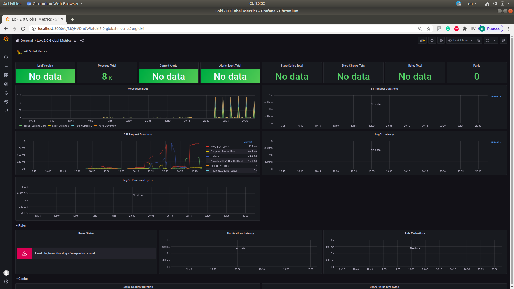
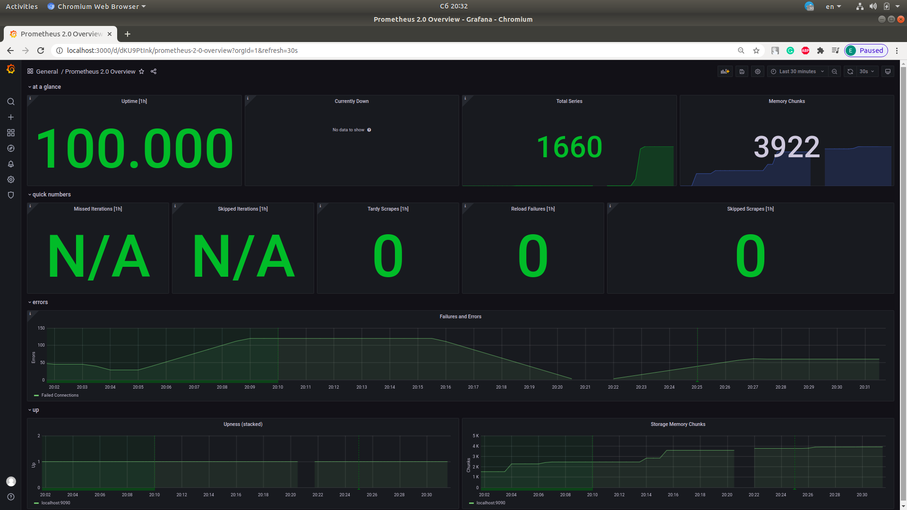
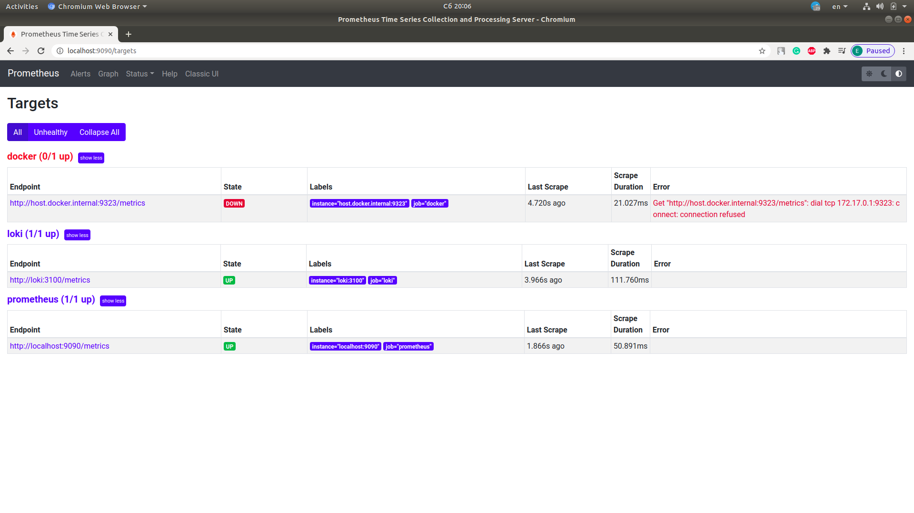
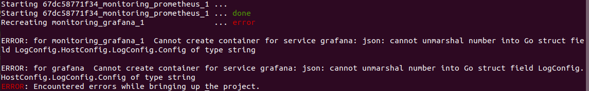

# LOGGING.md

## Report

### Lab 7

### Lab 8

#### Docker logging

Unfortunatly only windows and mac versions of docker engine support `host.docker.internal` as a referenc to the host machine, thus working in ubuntu I was not able to collect it's metrics.

#### Log rotation

Docker internal log driver didn't allowed me to start containers if it was present.

## Best practices

1. Perform log ratation
2. Make backups
3. Use consistent format
4. Utilize alerts (`Sentry`)
